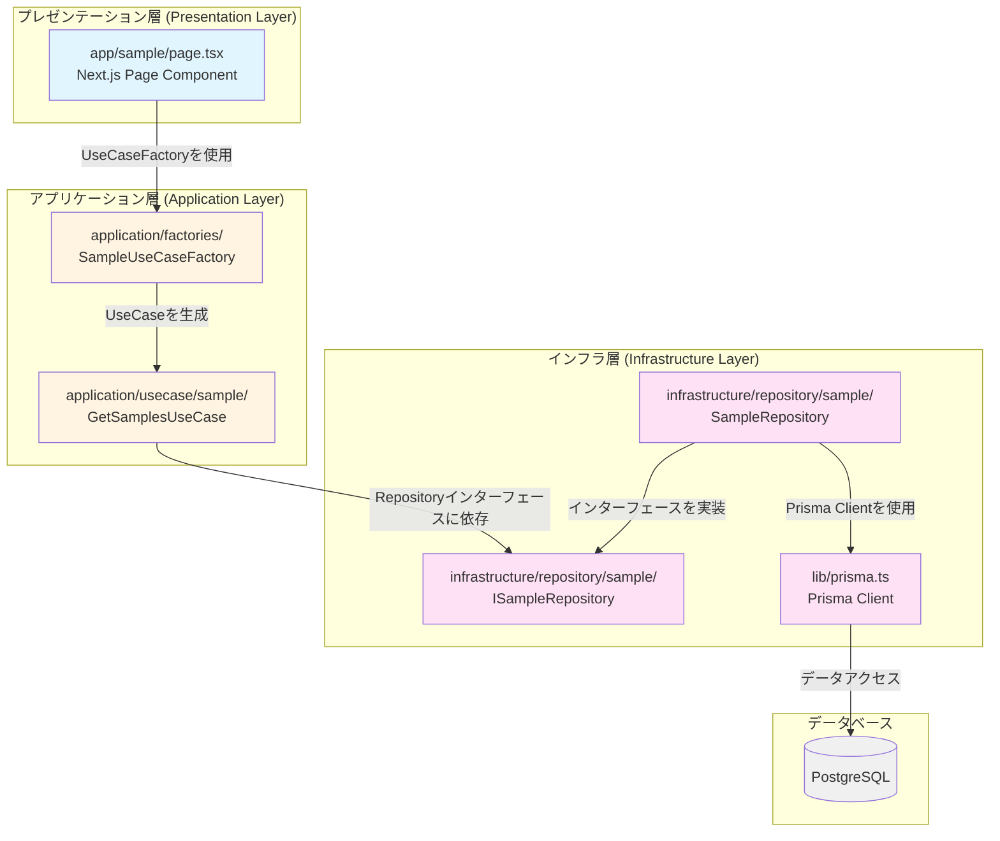
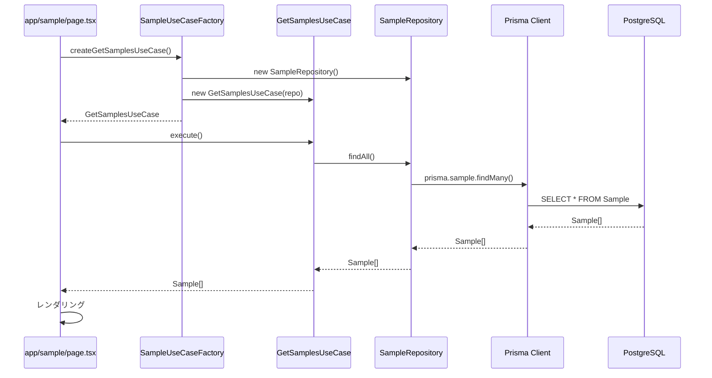

# Next.js+Prismaでアプリケーションを作る際のテンプレート

## アーキテクチャ構成

### FE側の構成

### BE側の構成

クリーンアーキテクチャで構成している。

#### レイヤー構成図


#### データフロー


#### ディレクトリ構成
```
app/                          # プレゼンテーション層
├── sample/
│   └── page.tsx             # ページコンポーネント

application/                  # アプリケーション層
├── factories/                # UseCase生成ファクトリ
│   └── SampleUseCaseFactory.ts
└── usecase/                  # ユースケース
    └── sample/
        └── GetSamplesUseCase.ts

infrastructure/               # インフラ層
└── repository/               # リポジトリ実装
    └── sample/
        ├── ISampleRepository.ts    # インターフェース
        └── SampleRepository.ts     # 実装

lib/                          # インフラ層（共通）
└── prisma.ts                 # Prisma Client
```

#### 依存関係の原則

- **プレゼンテーション層** → **アプリケーション層**のみに依存
- **アプリケーション層** → **インフラ層のインターフェース**に依存
- **インフラ層** → **インターフェースを実装**し、**Prisma Client**を使用
- 内側の層は外側の層に依存しない（依存性の逆転の原則）

## よく使用するコマンド

### 基本

#### コンテナ環境にログインする方法
```bash
docker exec -it my-next-template-app-web-1 bash
```

### prisma関連

#### migrationファイルを作成するコマンド（コンテナ内で実施）
```bash
npx prisma migrate dev --create-only

# --create-onlyを消せば、DBにも反映できる
```
