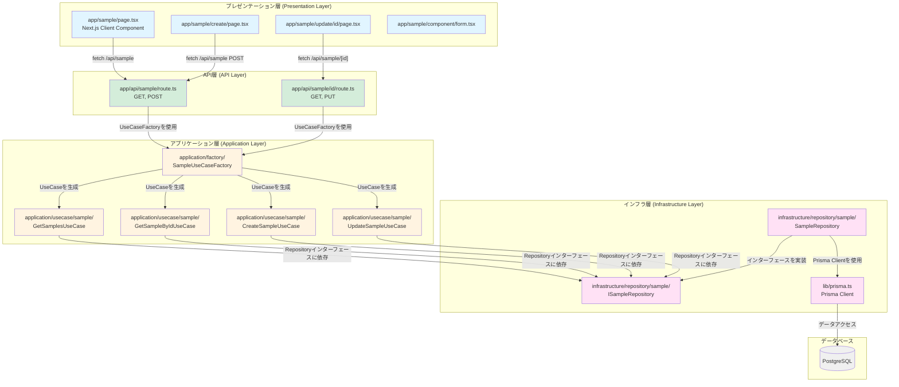
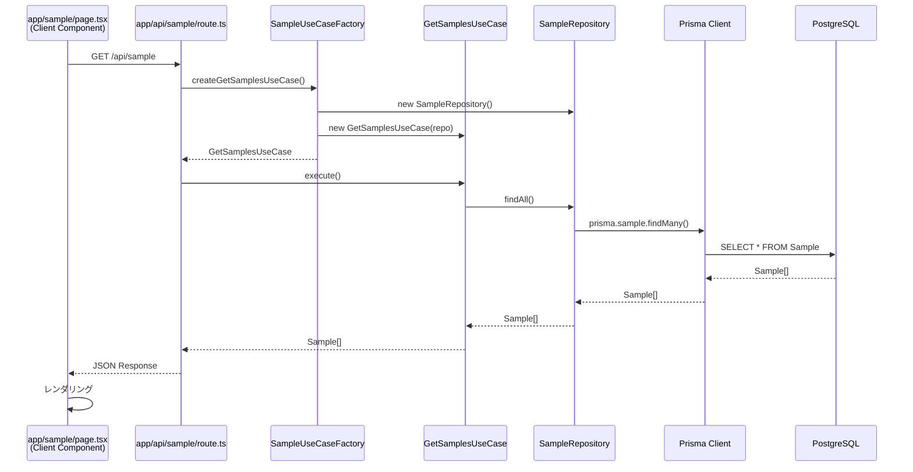

# Next.js+Prismaでアプリケーションを作る際のテンプレート

## アーキテクチャ構成

### FE側の構成

#### ディレクトリ構成
```
プロジェクトルート/
├── component/              # 共通コンポーネント
│   └── AuthButton.tsx
├── hooks/                  # 共通カスタムフック
│
app/                        # Next.js App Router
├── sample/                 # サンプル機能
│   ├── page.tsx           # 一覧ページ
│   ├── create/
│   │   └── page.tsx       # 作成ページ
│   ├── update/
│   │   └── [id]/
│   │       └── page.tsx   # 更新ページ
│   ├── component/         # サンプル専用コンポーネント
│   │   └── form.tsx
│   └── hooks/             # サンプル専用カスタムフック
```

#### 構成の原則

- **共通コンポーネント・フック**: プロジェクトルート直下の`component/`と`hooks/`に配置
  - 複数の機能で再利用されるコンポーネントやフック
  - 例: `AuthButton.tsx`（認証関連の共通コンポーネント）

- **機能専用コンポーネント・フック**: 各機能フォルダ配下に配置
  - `app/sample/component/`: サンプル機能専用のコンポーネント
  - `app/sample/hooks/`: サンプル機能専用のカスタムフック
  - その機能でのみ使用されるコンポーネントやフック

- **ページコンポーネント**: `app/[feature]/page.tsx`に配置
  - Next.js App Routerの規約に従う
  - クライアントコンポーネントとして実装（API経由でデータ取得）

### BE側の構成

クリーンアーキテクチャで構成している。

#### レイヤー構成図


#### データフロー（一覧取得の例）


#### ディレクトリ構成
```
app/                          # プレゼンテーション層
├── sample/
│   ├── page.tsx             # 一覧ページ（クライアントコンポーネント）
│   ├── create/
│   │   └── page.tsx         # 作成ページ
│   ├── update/
│   │   └── [id]/
│   │       └── page.tsx     # 更新ページ
│   └── component/
│       └── form.tsx          # フォームコンポーネント
└── api/                      # API層
    └── sample/
        ├── route.ts          # GET（一覧）, POST（作成）
        └── [id]/
            └── route.ts      # GET（取得）, PUT（更新）

application/                  # アプリケーション層
├── factory/                  # UseCase生成ファクトリ
│   └── SampleUseCaseFactory.ts
└── usecase/                  # ユースケース
    └── sample/
        ├── GetSamplesUseCase.ts
        ├── GetSampleByIdUseCase.ts
        ├── CreateSampleUseCase.ts
        └── UpdateSampleUseCase.ts

infrastructure/               # インフラ層
└── repository/               # リポジトリ実装
    └── sample/
        ├── ISampleRepository.ts    # インターフェース
        └── SampleRepository.ts     # 実装

lib/                          # インフラ層（共通）
└── prisma.ts                 # Prisma Client
```

#### 依存関係の原則

- **プレゼンテーション層** → **API層**のみに依存（HTTPリクエスト経由）
- **API層** → **アプリケーション層**のみに依存（UseCaseFactory経由）
- **アプリケーション層** → **インフラ層のインターフェース**に依存
- **インフラ層** → **インターフェースを実装**し、**Prisma Client**を使用
- 内側の層は外側の層に依存しない（依存性の逆転の原則）

#### APIエンドポイント

- `GET /api/sample` - サンプル一覧を取得
- `POST /api/sample` - サンプルを作成
- `GET /api/sample/[id]` - 指定IDのサンプルを取得
- `PUT /api/sample/[id]` - 指定IDのサンプルを更新
- `DELETE /api/sample/[id]` - 指定IDのサンプルを削除

## よく使用するコマンド

### 基本

#### コンテナ環境にログインする方法
```bash
docker exec -it my-next-template-app-web-1 bash
```

### prisma関連

#### migrationファイルを作成するコマンド（コンテナ内で実施）
```bash
npx prisma migrate dev --create-only

# --create-onlyを消せば、DBにも反映できる
```
